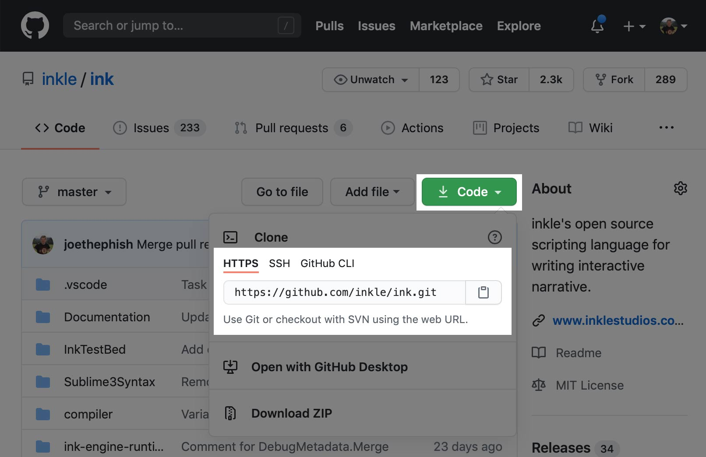
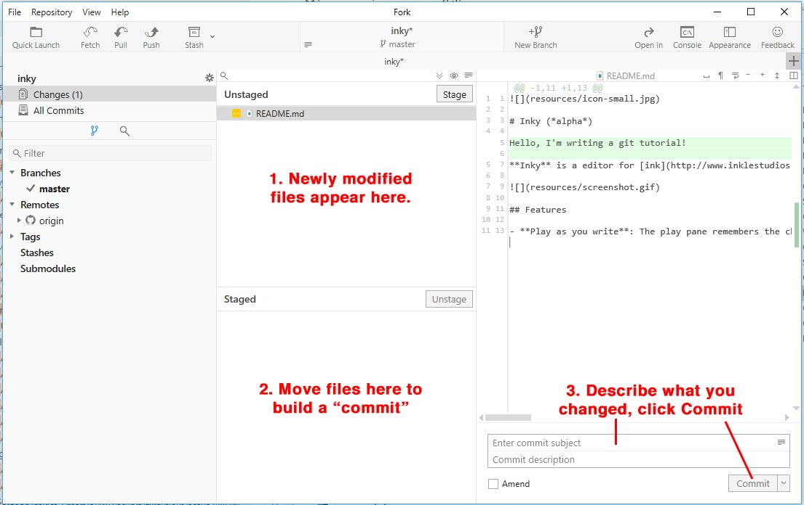
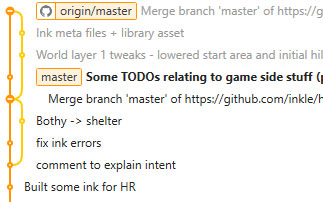
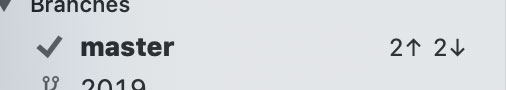

# git for Unity game developers

By Joseph Humfrey | [@joethephish](https://www.twitter.com/joethephish)

Git is a "version control system". You can store a project online, and git will keep track of all the changes you make the files, and allow multiple people to collaborate on them together. It's especially good for collaborating on pure text files, though it can be used for anything.

Although lots of programmers and online tutorials will swear by using git on the command line, you don't need to. There are plenty of UI-based apps around, and lots of programmers use these too!

Git is just the name of the tech, like "the web". And just as you need a web browser to browse the web, you can use an app as an interface to git. The one I'd recommend is [Fork](https://www.fork.dev), though [Source Tree](https://www.sourcetreeapp.com) is also pretty good. Both are available on both Windows and macOS.

Git projects (repos) can be hosted from sites like [GitHub](https://www.github.com) or [Bitbucket](https://bitbucket.org/).

**For this tutorial, I will assume that there's already a project stored on GitHub that someone else has set up, and they're inviting you to contribute on it.**

The guide was written for people new to git (especially artists), coming to work on our team at inkle, but I thought it was worth making it public in case it would be publicly useful!

## Glossary of terms

Just skip over this, but please feel free to refer back to it if you need to as you read through the tutorial. Git can use rather unconventional terminology!

* **Repository, repo**: A project in git.
* **Clone**: Download a fresh new copy of a project that's available online 
* **Commit**: A bunch of changes packaged up and given a name (can be both a noun "a commit" and a verb "commit some files").
* **Pull**: *Download* the latest set of changes (commit) from collaborators.
* **Push**: *Upload* your own changes (commits).
* **Fetch**: You can think of this as like a GitHub refresh to see what's available to pull. (This isn't actually 100% true but let's pretend it is for now.)

## Downloading a new project (repo)

* Create a GitHub account if you haven't already
* If the repo you want to contribute to is private, you'll need to be invited
* Download [Fork](https://www.fork.dev)
* Open Fork, and go to File -> Clone...
* Paste in the URL that you'll find here. I recommend clicking the **HTTPS** option for beginners. SSH is more complicated to setup, but means you never have to enter any passwords.
    
    
    
* Choose where you want to store the project repo on your computer.
* Click Clone!

It will begin downloading onto your computer.

## A tour of Fork

The Unstaged area shows any files that have been modified in the project on your computer:

* Yellow `...`: existing file that you're modifying
* Green `+`: a file that you're adding
* Red `-`: a file that you're removing

Note the present tense: you haven't actually "commited" any of these changes. There's two steps that need to be taken before changes are are made available to other people: you'll need to **commit** the changes (collect them up, give them a name) and **push** them (upload them so that they're available to others).

## Your first commit

A **commit** is set of (usually related) changes that you've collected together and given a name.

> **Why Commits?**
> It's helpful to group changes into commits like this so that you can easily read a history of what people have been working on in the project as well as revert them easily if necessary.

To create your commit, simply drag files from the **Unstaged** section down the **Staged** section. You can also drag them back if you change your mind. Once you're happy with what you've staged, simply enter a name for the commit and click Commit.

At any point you can choose to revert changes by right-clicking and choosing "Discard" in the Unstaged area. (If you've already staged a file, you'll need to unstage it before you can discard it.)

**See some files you don't recognise? See "Why are there a bunch of changes I don't recognise? What do I do with them?" in Common questions, below!** 

Now you've made your first commit, you're ready to push (upload) it!

### Pull before push

However, **before pushing, you should pull**. This is because you need to download the latest version of the project (commits from other team members) before integrating your work into it.

## Download the latest updates from a project (pulling)

Downloading the latest updates from other collaborators is called **pulling**.

To do so, guess what? Click the **Pull** button, in the toolbar!

If you're an artist creating assets this should usually be straightforward - just press the **Pull** button, wait for it to complete (and maybe merge your work into other peoples' commits), then press the **Push** button.

Sometimes though this can create problems if two people have made changes to the same file, and git doens't know how to handle it. See **"What do I do about a merge conflict?"** in Common Questions.

However, often git will create an extra harmless merge commit and you don't have to worry about it.

Don't worry if you forget to pull before pushing. Sometimes it'll just work (there are no commits to pull anyway), and if it doesn't work it's harmless, but might give you a confusing error message.

## Push! (Upload your work to share it)

After making a commit and pulling, pushing should be easy, just click the **Push** button.

## Understanding the list of commits

By clicking "All Commits" you can see both your own commits as well as those that have been created by other people.

Newer commits are higher up on the list.

* **origin/master** - This is the label for what's currently on GitHub.
* Grey commits - these are available commits that you haven't pulled
* **master** - the bold commit - this is your latest commit.

So, when "master" and "origin/master" are on the same commit, it means that you've pushed your latest work to GitHub successfully.

The "train lines" show the path that development took by different team members. They diverge when two people were working on stuff at the same time and added a commit on top of the same previous one. 

## Undertanding the up/down arrows

This is a helpful summary that shows:

* **Up arrow**: How many commits you have created that you need to push (upload).
* **Down arrow**: How many commits are on GitHub that were created by other people that you need to pull (download).

You can press the **Fetch** button to refresh it.

## Summary of workflow: Pull, Do stuff, Commit, Discard, Pull, Push

This is the general procedure and order that you should work in with git:

1. Before starting something new, **pull** to download the latest version of the project. This minimises the risk that you'll get conflicts from someone else's changes.
2. **Do stuff! Make changes to files, make new files, whatever.**
3. **Commit** your work
4. **Discard** anything you don't recognise or don't need
5. **Pull** latest from the repo again. This is necessary in case someone has pushed any commits while you were working.
6. **Push** your commit!

## Common Questions

### Why are there a bunch of changes I don't recognise? What do I do with them?

This is something that happens frequently, especially with Unity. Don't worry!

This is because Unity may automatically edit files on your behalf.

Here are some suggestions for what to do with them:

* **.meta files**: Unity creates these automatically for every single asset and folder in the project.
    * If their name matches a new file you've added, include it with your commit.
    * If you notice there's one for an empty folder in the project, delete the empty folder and the related meta file.
    * If in doubt for other meta files, just add them to a fresh commit (we just name this "meta churn"). This can happen if people change files and forget to deal with the meta files themselves, but it's harmless.
* **.unity files**: These are Unity scene files. If you think you've made changes to the scene, commit them! However, sometimes Unity might end up making changes to things you think you haven't changed. You should probably just discard these.
* **Anything else?** Most of the time you can probably discard anything you don't recognise. Otherwise, just ask the project owner. You'll get into the habit of understand what you should commit and what you should discard.

### What do I do about a merge conflict?

Sometimes when you pull, it turns out you and another collaborator have both commited changes to the same file. Sometimes (especially with text files), git is able to resolve both of these changes automatically. However, often, it can't, creating a **merge conflict**.

**TODO: Screenshot and instructions. This can be complicated! :-( **
